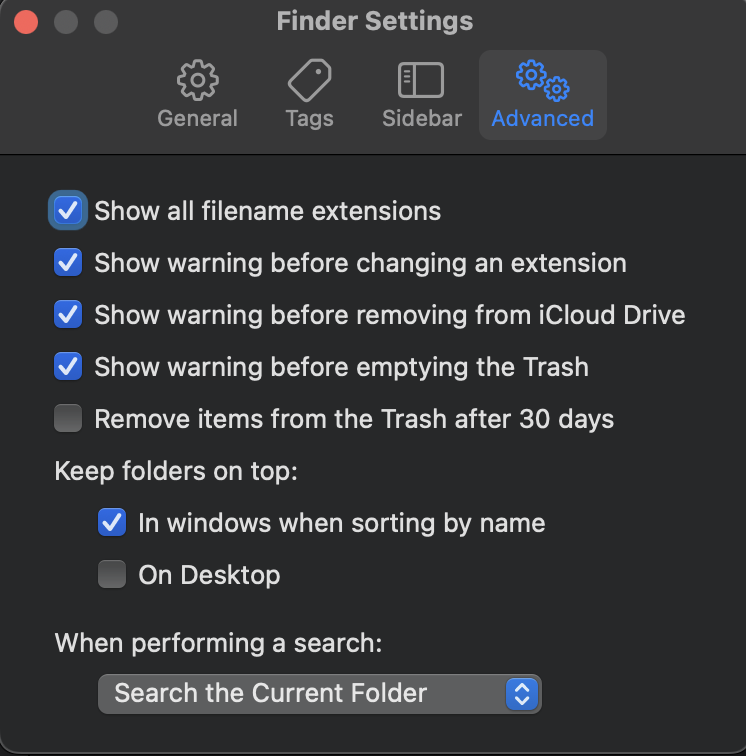
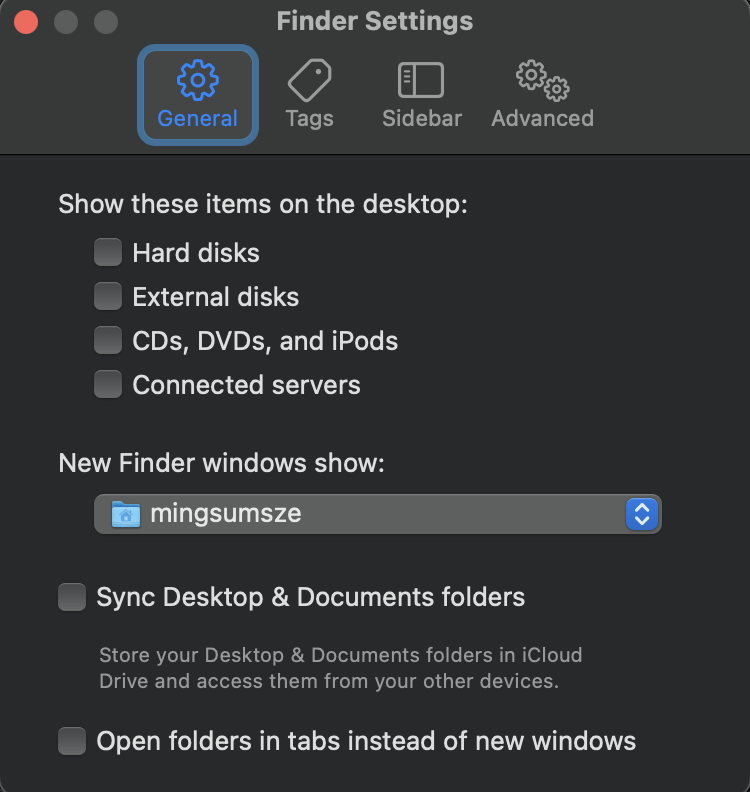
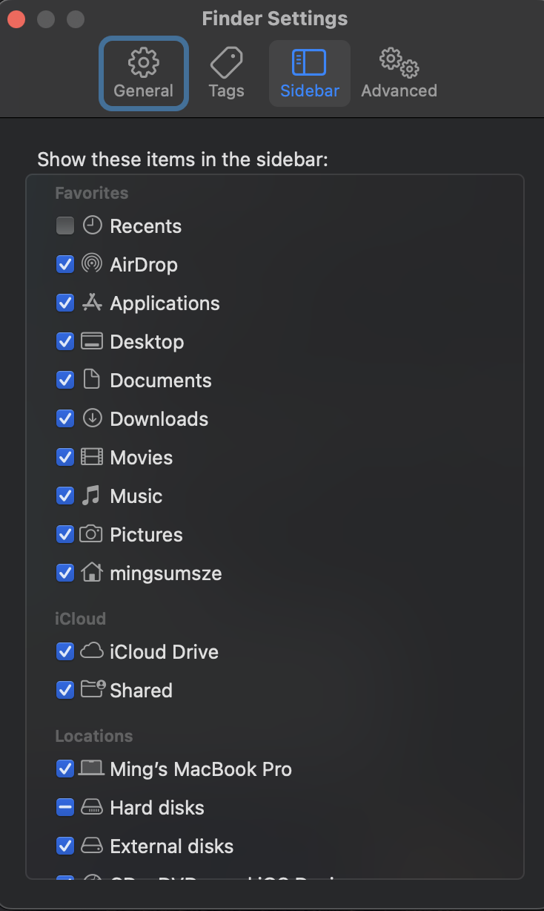

# MacOS

```bash
# If were to install in custom dir. But this can cause issues
# In zsh / bash
mkdir homebrew && curl -L https://github.com/Homebrew/brew/tarball/master | tar xz --strip 1 -C homebrew && export PATH="$HOME/homebrew/bin:$PATH"
```

Install command line developer tools
```bash
sudo xcode-select --install
```

Setup system settings
```bash
osx_init
```

Create symlink to iCloud:
```bash
ln -s ~/Library/Mobile\ Documents/com\~apple\~CloudDocs ~/cloud
```

Install brew "packages"
```bash
# In nushell
brew-bundle-install
```

Karabiner:
```bash
cd ~/.config/karabiner && npx tsx config.ts
```

Change default shell to nushell or brew's installation of zsh:
https://www.nushell.sh/book/default_shell.html#setting-nu-as-default-shell-on-your-terminal
```bash
# To either
# /opt/homebrew/bin/zsh
# /opt/homebrew/bin/nu
```

Optional: Install custom builds of fzf and yazi:
```bash
# Inside fzf project
FZF_VERSION=0 make install
cp <binary> ~/bin

# Inside yazi project
cargo build --release
cp <binary> ~/bin

# Or install from cargo
# https://yazi-rs.github.io/docs/installation/#crates
cargo install --force yazi-build
# Or
cargo install --force --git https://github.com/sxyazi/yazi.git yazi-build
```

Create symlink to VSCode/Cursor config:
```bash
rm -rf ~/Library/Application\ Support/Code/User
# Or if using cursor
# rm -rf ~/Library/Application\ Support/Cursor/User
cd ~/Library/Application\ Support/Code
# cd ~/Library/Application\ Support/Cursor
ln -s ~/.config/vscode/User User
```

Configure Finder settings:


